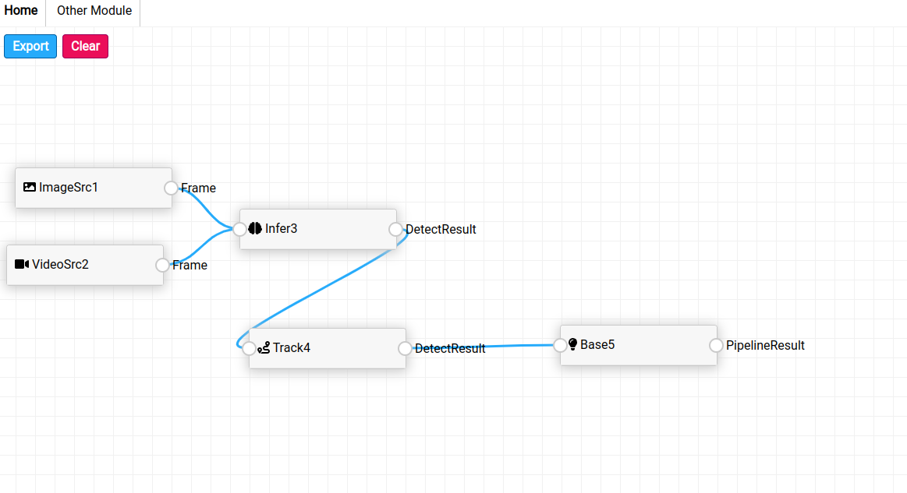

# VideoPipeline可视化配置工具

该工具是为了给[VideoPipeline](https://github.com/weinaike/video_pipeline)提供可视化配置，可能未及时更新。

## 依赖

1. 安装Node 和 npm

* 方法1

```
sudo apt update
sudo apt install nodejs npm
```

* 方法2：

```
curl -sL https://deb.nodesource.com/setup_14.x | sudo -E bash -
sudo apt install nodejs
node --version
npm --version
```

方法3：

```
curl -o- https://raw.githubusercontent.com/nvm-sh/nvm/v0.35.3/install.sh | bash
export NVM_DIR="$HOME/.nvm"
[ -s "$NVM_DIR/nvm.sh" ] && \. "$NVM_DIR/nvm.sh"
nvm install node
```

2. 安装依赖

   ```
   cd /path/to/dir
   npm install
   ```
3. 编译

```
npm run build
```

## UI配置

1. 浏览器打开 index.html
2. 配置流水线

   
3. export按钮到处配置json

## json转换

将json文件导入video_pipeline的tool目录下， 执行transform_json.py生成流水线需要的配置文件

## 新增节点类型

按如下两步即可步骤

1. node.js中增加对应节点信息，
2. 再index.html中 `<div class="col"> 增加显示内容`
